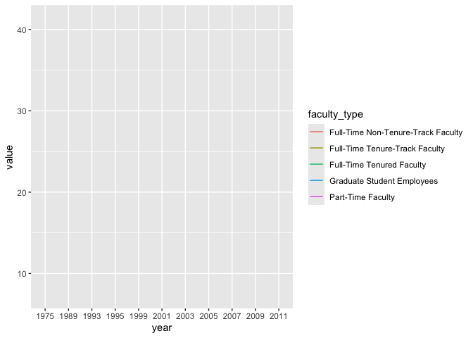
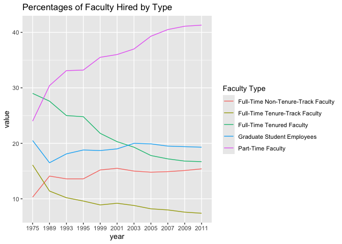
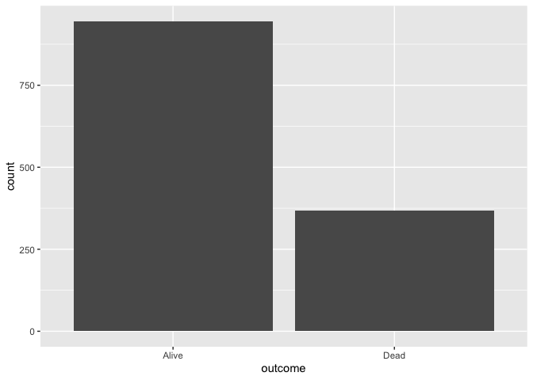
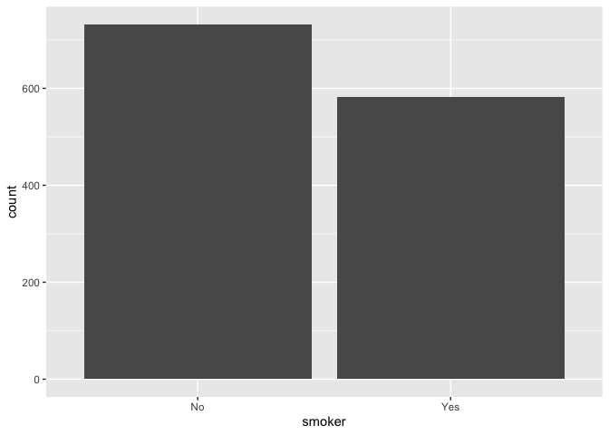
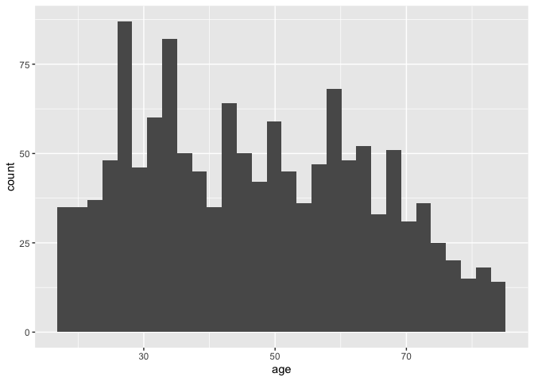
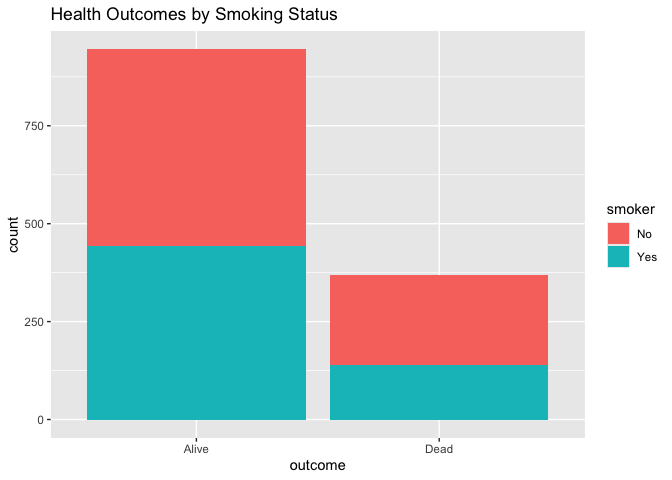
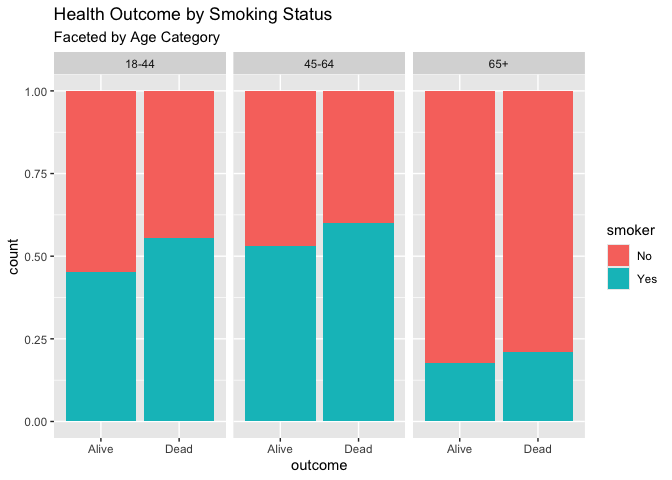

Lab 06 - Ugly charts and Simpson’s paradox
================
Insert your name here
Insert date here

### Load packages and data

``` r
library(tidyverse) 
library(dsbox)
library(mosaicData) 
```

``` r
library(usethis)
use_git_config(
  user.name = "Rachel Weiner",
  user.email = "weinra22@wfu.edu"
)
```

``` r
staff <- read_csv("data/instructional-staff.csv")
```

    ## Rows: 5 Columns: 12
    ## ── Column specification ────────────────────────────────────────────────────────
    ## Delimiter: ","
    ## chr  (1): faculty_type
    ## dbl (11): 1975, 1989, 1993, 1995, 1999, 2001, 2003, 2005, 2007, 2009, 2011
    ## 
    ## ℹ Use `spec()` to retrieve the full column specification for this data.
    ## ℹ Specify the column types or set `show_col_types = FALSE` to quiet this message.

### Practice

``` r
staff_long <- staff %>%
  pivot_longer(cols = -faculty_type, names_to = "year") %>%
  mutate(value = as.numeric(value))
staff_long
```

    ## # A tibble: 55 × 3
    ##    faculty_type              year  value
    ##    <chr>                     <chr> <dbl>
    ##  1 Full-Time Tenured Faculty 1975   29  
    ##  2 Full-Time Tenured Faculty 1989   27.6
    ##  3 Full-Time Tenured Faculty 1993   25  
    ##  4 Full-Time Tenured Faculty 1995   24.8
    ##  5 Full-Time Tenured Faculty 1999   21.8
    ##  6 Full-Time Tenured Faculty 2001   20.3
    ##  7 Full-Time Tenured Faculty 2003   19.3
    ##  8 Full-Time Tenured Faculty 2005   17.8
    ##  9 Full-Time Tenured Faculty 2007   17.2
    ## 10 Full-Time Tenured Faculty 2009   16.8
    ## # ℹ 45 more rows

``` r
staff_long %>%
  ggplot(aes(x = year, y = value, color = faculty_type)) +
  geom_line()
```

    ## `geom_line()`: Each group consists of only one observation.
    ## ℹ Do you need to adjust the group aesthetic?

<!-- -->

``` r
staff_long %>%
  ggplot(aes(
    x = year,
    y = value,
    group = faculty_type,
    color = faculty_type
  )) +
  geom_line() +
  labs(title = "Percentages of Faculty Hired by Type", color = "Faculty Type")
```

<!-- -->

### Exercise 1

``` r
data(Whickham)
```

This data set includes information regarding individuals health outcome
as either “alive” or “dead” as well as their age and whether or not they
smoke. As the data relies on current smoking behavior, this must be an
observational study because it is unethical to assign experimental
groups a “smoking treatment” if they were not already smokers. This
study simply collected information on both individuals who smoke and who
do not, without manipulating the groups themselves but simply observing
already present behaviors.

### Exercise 2

There are 1314 observations in this data set. Each observation
represents an individual participant from the study.

### Exercise 3

There are three variables in this data set, outcome, smoker, and age.
The outcome variable regarding whether the individual is alive or dead
and the smoker variable regarding whether the individual smokes (or
smoked) are categorical variables, as well as binary variables as there
is only two possible responses for each. For outcome, “dead” and “alive”
are the two possible responses where as “yes” and “no” are the only
possible responses for smoker. These variables are visualized below.

``` r
Whickham %>%
  ggplot(aes(x = outcome)) +
  geom_bar()
```

<!-- --> Above is
the visualized variable of outcome, as the individual is either alive or
dead. The majority of respondents are alive.

``` r
Whickham %>%
  ggplot(aes(x = smoker)) +
  geom_bar()
```

<!-- --> Above is the
visualized variabl of smoker as either someone who smokes (yes) or
someone who does not (no). The majority of participants do smoke, but a
similar but slightly less amount of participants do not smoke.

``` r
Whickham %>%
  ggplot(aes(x = age)) +
  geom_histogram()
```

    ## `stat_bin()` using `bins = 30`. Pick better value `binwidth`.

<!-- --> Above is a
histogram visualizing the age of participants and the distribution of
their ages. As we can see, there is a relatively equal distribution of
ages across all participants but there is a slightly greater amount
around the age of 30.

### Exercise 4

I would expect the relationship between smoking status and health to be
negatively correlated. An individual that smokes is more likely to have
a poor health outcome compared to individuals who do not smoke.

### Exercise 5

``` r
Whickham %>%
  count(smoker, outcome)
```

    ##   smoker outcome   n
    ## 1     No   Alive 502
    ## 2     No    Dead 230
    ## 3    Yes   Alive 443
    ## 4    Yes    Dead 139

``` r
contingency_table_2 <- table(Whickham$smoke, Whickham$outcome)

ftable(contingency_table_2)
```

    ##      Alive Dead
    ##                
    ## No     502  230
    ## Yes    443  139

``` r
Whickham %>%
  ggplot(aes(x = outcome, fill = smoker)) + 
  geom_bar() +
  labs(title = "Health Outcomes by Smoking Status")
```

<!-- --> The bar plot
above plots the health outcome of participants by smoking status. As we
can see, about an even amount of alive participants smoke and slightly
more of the dead particpants do not smoke. This visualization does not
support my expected relationship between these variables as there is no
clear effect of smoking on health outcome.

### Exercise 6

Now I will create a new age variable that puts the participants into
three age categories. The three categories are “18-44”, “45-64”, and
“65+”.

``` r
Whickham <- Whickham %>%
  mutate(age_cat = case_when(age <= 44 ~ "18-44",
  age > 44 & age <= 64 ~ "45-64", age > 64 ~ "65+"))
```

### Exercise 7

``` r
contingency_table_3 <- table(Whickham$age_cat, Whickham$smoke, Whickham$outcome)

ftable(contingency_table_3)
```

    ##            Alive Dead
    ##                      
    ## 18-44 No     327   12
    ##       Yes    270   15
    ## 45-64 No     147   53
    ##       Yes    167   80
    ## 65+   No      28  165
    ##       Yes      6   44

``` r
ggplot(Whickham, aes(x = outcome, fill = smoker)) +
  geom_bar(position = "fill") +
  facet_wrap(~age_cat) +
  labs(title = "Health Outcome by Smoking Status",
       subtitle = "Faceted by Age Category")
```

<!-- --> Now that we
have faceted the visualization by age category, we are able to see that
there is a general
